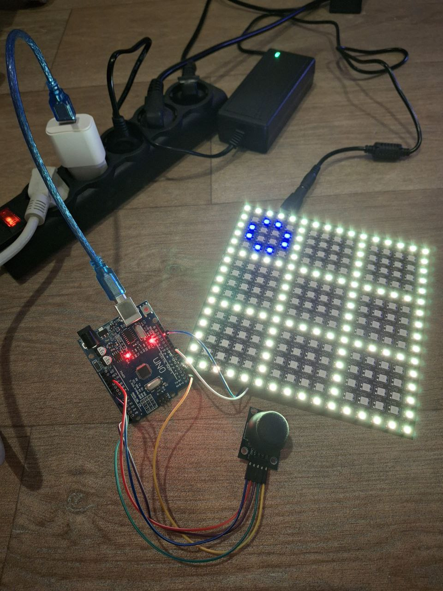

# 🎮 Arduino Tic-Tac-Toe on RGB LED Matrix

<p align="center">

</p>

A hardware implementation of the classic **Tic-Tac-Toe** game built with **Arduino, an RGB LED matrix, and a joystick controller**.

This project was created as part of my learning process in **embedded systems and C++ programming**.  
The main goal was not simply to build a small game, but to explore the **architecture of embedded code**, interaction between **hardware and software**, and to gain deeper understanding of **C++ syntax and logic structures**.

This is currently **one of the largest projects I have written so far**, both in terms of code size and system complexity.

The project includes:

- a fully playable Tic-Tac-Toe game
- joystick-controlled cursor
- rendering of the board and game symbols on an RGB LED matrix
- win detection logic
- visual animations
- hardware integration and debugging

---

# 📂 Project Structure

```structure of project
ARDUINO_Tic_Tac_Toe
│
├── media_files
│   ├── connecting_photo.jpg
│   ├── pinout_rgb_matrix.jpg
│   ├── system_photo.jpg
│   └── video_of_game_process.mp4
│
├── main_code.ino
├── notes.md
└── README.md
```

### Folder descriptions

**media_files/**  
Contains photos and video demonstrating the hardware setup and gameplay.

**main_code.ino**  
Main Arduino source file containing the entire game logic, rendering system, and input handling.

**notes.md**  
A collection of notes written during development.  
These include ideas, debugging observations, and thoughts recorded throughout the project.

**README.md**  
Project documentation.

---

# ⚙️ Hardware Components

The system is built using the following components:

- Arduino Uno
- WS2812 RGB LED Matrix
- Analog Joystick Module
- Power Supply
- Connecting wires
- USB cable
- Computer
- Patience
- And **a few spare nerve cells** 🧠 (highly recommended)

---

# 🧠 Project Goals

The purpose of this project was to:

- deepen understanding of **C++ syntax**
- practice **logic design**
- understand **embedded system architecture**
- learn how to connect **hardware inputs with software behavior**
- work with **coordinate mapping and rendering systems**
- debug real hardware interactions

Unlike a simple console program, this project required handling:

- hardware input
- coordinate systems
- rendering on an LED matrix
- state logic
- physical wiring
- real-world debugging

---

# 🎮 Features

The game includes:

- joystick-controlled cursor movement
- drawing of the game grid
- rendering of **X** and **O** symbols
- detection of winning combinations
- visual feedback on the LED matrix
- ability to play full rounds


---

# 🖼 Media

The repository includes:

- photos of the system
- a video demonstrating the gameplay


```
media_files/
    system_photo.jpg
    connecting_photo.jpg
    pinout_rgb_matrix.jpg
    video_of_game_process.mp4
```

---

# 📐 Circuit Diagram

A full **schematic diagram** of the wiring will be added later.

Unfortunately, I have not yet found a graphical editor that allows convenient drawing of all required hardware details.  
Because of this, the circuit will likely be **drawn manually and uploaded later**.

---

# 📓 Development Notes

Throughout the project I kept a set of notes describing:

- debugging observations
- architecture ideas
- hardware discoveries
- logic experiments

These notes can be found in:

``structure of project
notes.md
``

They document the development process and thinking behind the project.

---

# 🚀 What This Project Represents

This project represents an important step in my journey toward deeper understanding of:

- embedded programming
- hardware-software interaction
- C++ architecture
- system design

While the game itself is simple, the underlying system required designing and integrating multiple layers of logic and hardware.

---

# 💤 Final Note

This project was finished somewhere between **late night coding and early morning debugging**.

But in the end, the LEDs lit up, the game worked, and the system behaved exactly as intended.

And that moment makes the entire process worth it. ✨